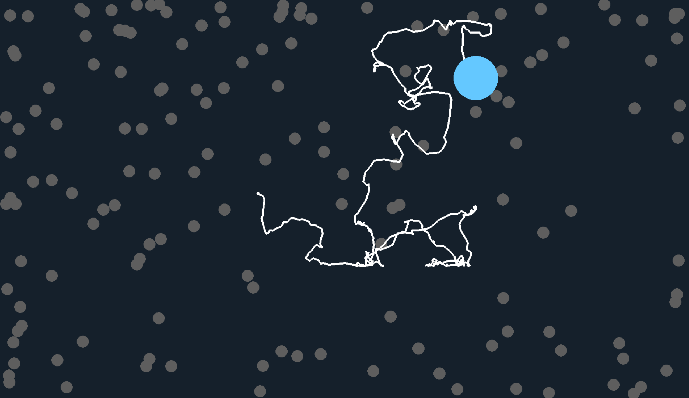

# Ruchy Browna

- Paweł Wysocki 325248
- Piotr Jabłoński 325163

## Temat projektu

Zagadnieniem naszego projektu było zaimplentowanie realistycznej symulacji ruchów Browna. Założyliśmy, że modelujemy ruch cząsteczki pyłku w płynie. W naszym przypadku cząsteczka pyłu ok. 30 razy cięższa i ok. 3,5 raza większa od cząsteczek płynu, których było 150.

## Wykorzystane oprogramowanie

Projekt został zaimplementowany w bibliotece do tworzenia gier i aplikacji multimedialnych `pygame`. Wykorzystaliśmy tą paczkę, ponieważ potrzebowaliśmy środowiska do tworzenia symulacji w czasie rzeczywistym, a `pygame` jako relatywnie proste do użycia narzędzie nam to umożliwiło. Użyliśmy też `numpy` do matematycznych obliczeń oraz `jupyter` do stworzenia raportu i analizy poszczególnych wariantów ruchów.

## Zawartość projektu

### Notebook `motion_showcase.ipynb`

W notebooku tym zawarte są:

- wprowadzenie teoretyczne omawiające po krótce, czym są ruchy Browna
- matematyczny opis tego zjawiska
- prezentacja różnych wariantów ruchów Browna (zwykły, z dryfem, geometryczny) wraz z demonstracją wpływu parametrów na ich działanie

### Plik `main.py`

Plik ten zawiera aplikację stworzoną w `pygame`, która pozwala zademonstrować ruchy Browna w czasie rzeczywistym. Dostępne są następujące scenariusze:

- `Two entities` - pokazuje, jak oddziałują ze sobą dwa ciała poruszające się zgodnie z ruchem Browna (rozwiązywanie kolizji)
- `Trailing entity` - pokazuje tor ruchu Browna dla jednego ciała przez zostawianie śladu
- `Different movement options` - porównanie zachowania dla różnych wariantów ruchów Browna:
  - ciało niebieskie - nieruchome
  - ciało zielone - ruch standardowy
  - ciało czerwone - ruch z dryfem
  - ciało białe - ruch geometryczny
- `Simulation` - główny cel naszego projektu. Symulacja ruchu Browna dla 150 cząsteczek płynu (poruszających się zgodnie ze standardowym ruchem Browna). Wizualizacja symulacji jest zrealizowana w formie animacji w czasie rzeczywistym. Ciało główne (cząsteczka pyłu, niebieska zostawiająca ślad) porusza się jedynie w wyniku uderzania w nie molekuł płynu. Poniżej przedstawiamy zrzut ekranu z symulacji:



### Folder `brownian`

W folderze tym znajduje się implementacja naszego projektu. Został on stworzony jako "mini-biblioteka", pozwalająca w prosty sposób tworzyć własne sceny, w których występują ruchy Browna. Przykłady, jak zbudować własny scenariusz, można znaleźć w pliku `examples.py`.

## Uruchomienie

Po ściągnięciu repozytorium na lokalny sprzęt należy zainicjować nowe wirtualne środowisko:

```shell
python -m venv .venv
```

Następnie zależnie od platformy trzeba doinstalować wszystkie zależności i można uruchomić projekt:

### Linux

```shell
.venv/bin/pip install -r requirements.txt
.venv/bin/python main.py
```

### Windows

```shell
.venv/Scripts/pip install -r requirements.txt
.venv/Scripts/python main.py
```

### Źródła

- https://en.wikipedia.org/wiki/Brownian_motion
- https://medium.com/@mlblogging.k/simulating-brownian-motion-and-stock-prices-using-python-17b6b4bd2a1
